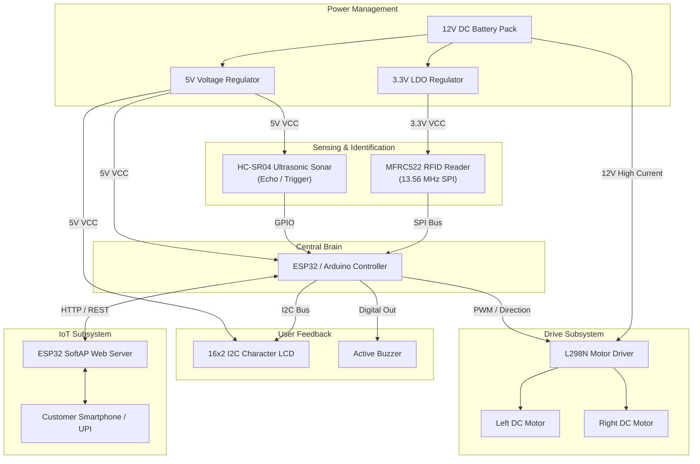
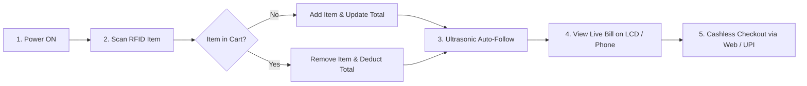

# 🛒 SMART SHOPPING TROLLEY

[](LICENSE)
[]()
[]()
[]()

> An IoT and Embedded Systems-enabled intelligent shopping cart featuring automated RFID billing, real-time LCD expenditure tracking, ultrasonic obstacle avoidance / customer following, and wireless digital checkout.

---

## 🎓 Academic Information
- **Institution**: [Don Bosco Institute of Technology (DBIT)](http://www.dbit.co.in), Mysore Road, Kumbalgodu, Bengaluru - 560074
- **Department**: Electronics and Communication Engineering
- **Project Type**: Mini-Project / Capstone Project (2025–26)
- **Guided By**: **Dr. Bhagya P**, Dept. of ECE

### 👥 Project Team
| Name | USN | Role |
| :--- | :--- | :--- |
| **Nandini K** | `1DB23EC101` | Hardware & Embedded C Development |
| **Navyashree S** | `1DB23EC103` | RFID & Real-Time Billing Integration |
| **Nageshwari B S** | `1DB23EC099` | IoT Connectivity & Circuit Design |

---

## 📌 Table of Contents
1. [Project Overview & Abstract](#-project-overview--abstract)
2. [Key Features](#-key-features)
3. [System Block Diagram & Architecture](#-system-block-diagram--architecture)
4. [Hardware & Software Specifications](#-hardware--software-specifications)
5. [Circuit Pin Mapping](#-circuit-pin-mapping)
6. [Repository Structure](#-repository-structure)
7. [Operating Procedure & Workflow](#-operating-procedure--workflow)
8. [Installation & Setup](#-installation--setup)
9. [Source Code Overview](#-source-code-overview)
10. [References & Citations](#-references--citations)

---

## 📖 Project Overview & Abstract

Traditional supermarket shopping often suffers from long checkout queues, manual barcode errors, and a lack of real-time budget tracking. 

The **Smart Shopping Trolley** overcomes these challenges by transforming a standard shopping cart into an autonomous embedded assistant:
- **Automatic Item Scanning**: Products equipped with RFID tags are identified instantly upon entry into the trolley.
- **Dynamic Cart Management**: Scanning an item adds it to the total bill; scanning an item already in the cart removes it.
- **Real-Time Display**: A 16x2 I2C LCD continuously reflects the product details and cumulative payable bill.
- **Smart Following & Collision Avoidance**: Ultrasonic sensors track customer distance to follow them autonomously while halting if obstacles appear within 15 cm.
- **IoT & Wireless Checkout**: ESP32 generates a local Wi-Fi dashboard allowing instant contactless digital payment and e-receipt generation.

---

## ✨ Key Features

- ⚡ **Zero-Queue Checkout**: Skip cashier queues with automated on-cart scanning.
- 💰 **Live Budget Monitoring**: Immediate price calculation and display.
- 🔄 **Add & Remove Item Toggle**: Seamless cart editing directly at the trolley.
- 🤖 **Ultrasonic Autonomous Mobility**: Guided human-following with collision safety.
- 📶 **IoT Digital Billing Web Server**: Built-in ESP32 web interface for mobile payment.
- 🔔 **Auditory Feedback**: Multi-tone buzzer confirmations for additions, removals, and unknown tags.

---

## 📊 System Block Diagram & Architecture



*For detailed block diagrams and descriptions, see [docs/BLOCK_DIAGRAM.md](file:///c:/Users/WIN10/Desktop/my%20projects%201/SMART-SHOPPING-TROLLEY-/docs/BLOCK_DIAGRAM.md).*

---

## 🛠 Hardware & Software Specifications

### Hardware Components
| Component | Model / Specification | Purpose |
| :--- | :--- | :--- |
| **Microcontroller** | ESP32 Dev Module / Arduino Nano | Core logic, sensor processing & Wi-Fi |
| **RFID Reader** | MFRC522 (13.56 MHz) / EM-18 | High-speed contactless tag scanning |
| **RFID Tags** | 13.56 MHz ISO14443A Keyfobs/Cards | Attached to supermarket merchandise |
| **Display** | 16x2 Character LCD + PCF8574 I2C | Real-time bill and item status display |
| **Proximity Sensor** | HC-SR04 Ultrasonic Module | Human-following & safety collision avoidance |
| **Motor Driver** | L298N Dual H-Bridge | PWM speed and directional motor control |
| **Drive Motors** | 2x 12V / 6V Geared DC Motors | Trolley locomotion |
| **Acoustic Alert** | 5V Piezo Active Buzzer | Scan/error auditory feedback |
| **Power Source** | 12V Rechargeable Battery Pack | System power supply |

### Software Stack
- **IDE**: Arduino IDE / PlatformIO
- **Programming Languages**: C++ (Embedded), HTML5, CSS3, JavaScript
- **Key Libraries**:
  - `SPI.h` & `Wire.h`
  - `MFRC522.h`
  - `LiquidCrystal_I2C.h`
  - `WiFi.h` & `WebServer.h`

---

## 🔌 Circuit Pin Mapping

### ESP32 Master Wiring Configuration
| Component | Module Pin | ESP32 GPIO | Notes |
| :--- | :--- | :--- | :--- |
| **MFRC522 RFID** | 3.3V | `3V3` | **Strictly 3.3V power** |
| | GND | `GND` | Common Ground |
| | RST | `GPIO 26` | Hardware Reset |
| | MISO | `GPIO 19` | VSPI MISO |
| | MOSI | `GPIO 23` | VSPI MOSI |
| | SCK | `GPIO 18` | VSPI SCK |
| | SDA (SS) | `GPIO 5` | VSPI Chip Select |
| **16x2 I2C LCD** | VCC | `5V / VIN` | 5V Power Supply |
| | GND | `GND` | Ground |
| | SDA | `GPIO 21` | Hardware I2C SDA |
| | SCL | `GPIO 22` | Hardware I2C SCL |
| **HC-SR04** | Trig / Echo | `GPIO 13` / `GPIO 12` | 5V Supply with Voltage Divider |
| **L298N Driver** | ENA / ENB | `GPIO 14` / `GPIO 15` | PWM Speed Channels |
| | IN1, IN2, IN3, IN4 | `GPIO 27, 4, 16, 17` | Direction Channels |
| **Buzzer** | Signal (+) | `GPIO 25` | Active high pulse |

*For complete wiring tables and Arduino schematics, see [docs/CIRCUIT_DIAGRAM.md](file:///c:/Users/WIN10/Desktop/my%20projects%201/SMART-SHOPPING-TROLLEY-/docs/CIRCUIT_DIAGRAM.md).*

---

## 📁 Repository Structure

```text
SMART-SHOPPING-TROLLEY-/
├── README.md                               # Master Project Overview & Documentation
├── Fundamental overview                    # Quick Hardware & System Overview
├── docs/
│   ├── PROJECT_SYNOPSIS.md                 # Complete DBIT Academic Project Synopsis
│   ├── BLOCK_DIAGRAM.md                    # Detailed Subsystem & Block Architecture
│   ├── CIRCUIT_DIAGRAM.md                  # Comprehensive Pinout & Wiring Schematics
│   └── FLOWCHART_AND_PROCEDURE.md          # Step-by-Step Operating Procedures & Flowcharts
├── diagrams/
│   ├── system_architecture.mermaid         # Raw Mermaid System Architecture Diagram
│   └── shopping_flowchart.mermaid          # Raw Mermaid State Flowchart Diagram
├── src/
│   ├── 01_obstacle_avoidance_and_movement/
│   │   └── obstacle_avoidance_and_movement.ino # Motor Control & Ultrasonic Follower
│   ├── 02_rfid_billing_system/
│   │   └── rfid_billing_system.ino             # RFID Scanning + I2C LCD + Buzzer Billing
│   └── 03_integrated_smart_trolley/
│       └── integrated_smart_trolley.ino        # Full System (RFID + Motors + LCD + IoT Web Server)
└── Main code/                              # Original source sketches
    ├── Test code 1                         # Motor test code
    └── Test code 2                         # RFID & LCD test code
```

---

## ⚙️ Operating Procedure & Workflow



1. **Power Up**: Turn on the main 12V battery switch. The LCD initializes with *"SMART TROLLEY - Ready to Scan"*.
2. **Scan Item (Addition)**: Bring the RFID product tag near the reader. The buzzer beeps once, the LCD displays product name and price, and adds the cost to `Total Bill`.
3. **Scan Item (Removal)**: Scan an existing item again. The buzzer double-beeps, the LCD displays `REMOVED`, and subtracts the cost.
4. **Follow Mode**: As the shopper moves ahead within 15 cm – 60 cm, the trolley drives forward to follow automatically.
5. **Checkout**: Connect your phone to the cart's Wi-Fi network (`SmartTrolley_Cart01`) to inspect your digital invoice and complete the transaction.

*Read full instructions in [docs/FLOWCHART_AND_PROCEDURE.md](file:///c:/Users/WIN10/Desktop/my%20projects%201/SMART-SHOPPING-TROLLEY-/docs/FLOWCHART_AND_PROCEDURE.md).*

---

## 🚀 Installation & Setup

### 1. Arduino IDE Setup
1. Open **Arduino IDE**.
2. Go to **Sketch > Include Library > Manage Libraries...**
3. Install the following libraries:
   - **`MFRC522`** by GithubCommunity / Miguel Balboa
   - **`LiquidCrystal I2C`** by Frank de Brabander
4. Under **Tools > Board**, select **ESP32 Dev Module** (or **Arduino Nano**).

### 2. Configure Tag UIDs
1. Flash `src/02_rfid_billing_system/rfid_billing_system.ino`.
2. Open the **Serial Monitor (115200 baud)** and scan each product tag to read its UID.
3. Update the `productUIDs[]` array in the code with your specific tag IDs.
4. Re-upload the sketch.

---

## 📚 References & Citations

1. **M.T. Dangat, Prathamesh Pawar, et al.**, *"Smart Trolley with Automatic Billing System using RFID"*, IJRASET.
2. **Shalini S, Sahana T Basanagoudra, et al.**, *"RFID-Based Smart Billing Trolley"*, IARJSET.
3. **Raj Kamal**, *Embedded Systems: Architecture, Programming and Design*, McGraw Hill.
4. **Muhammad Ali Mazidi**, *The 8051 Microcontroller and Embedded Systems*, Pearson.
5. **Rajkumar Buyya, Amir Vahid Dastjerdi**, *Internet of Things: Principles and Paradigms*.

---

## 📄 License
This project is open-source and available under the [MIT License](LICENSE).
